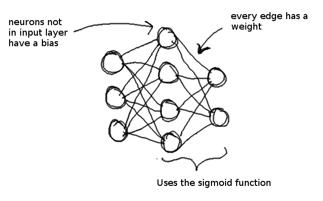

# Neurose
#### A simple neural network library for your simple neural network needs. 

All the weekly reports and documentation is in the [wiki](https://github.com/irenenikk/neurose/wiki). There you will also find some calculations and notes about neural networks and the algorithms used.

## Current features:
- Linear layer with biases
- Activation functions:
  - Sigmoid
  - ReLu
  - Passive (no activation)
- Loss functions
  - Mean squared error


## Todo:

- [ ] Backpropagate biases
- [ ] Add cross entropy loss
- [ ] Build an example with MNIST

## Running the example model

0. Make sure you have python 3.x

1. After cloning the project, install depedencies with `pip install -r path/to/requirements.txt`

2. Run the example code with `python path/to/example.py`

3. The program will print the loss and output for each epoch.

4. At the moment, the linear regression is such that the network should learn to print `[2, 4, 6, 8]`.

## Building a model with Neurose

Neurose is used in a very similar way to Pytorch. In `example.py` you will find a working example of building a neural network with neurose.

### Defining the architecture:

Define a class which inherits neuros's `Net`. The parent initializer takes the loss function and learning rate as parameters: here the loss function is mean squared error, and the learning rate `0.02`. Like in Pytorch, you have to define the forward pass manually by transforming the input and returning it. The activation functions are used with `call` and the layers using `forward`. The network is passed to the activation functions and layers so that parameters can be saved for backpropagation during feedforward.

For example, the following network

```python
from net import Net
from layers import Linear
from functions import MeanSquaredError as MSE

class Example(Net):

    def __init__(self):
        super().__init__(MSE, learning_rate=0.02)
        self.a1 = Sigmoid(self)
        self.l1 = Linear(self, 3, 4)
        self.l2 = Linear(self, 4, 1)

    def forward_pass(self, input):
        x = self.a1.call(self.l1.forward(input))
        x = self.a1.call(self.l2.forward(x))
        return x
```

would result in the following neural network:



### Training with Neurose

You can then initialize your network:

```python
    example = Example()
```

Resetting parameters between epochs:

```python
    example.reset_saved_parameters()
```

Going through one forward pass. The input is expected to be a numpy array of the shape `(batch_size, input_size)`:

```python
    output = example.forward(input)
```

Calculating the loss for a single batch. The loss function is defined in initialization. Make suret that both `output` and `true_labels` are numpy arrays.

```python
    loss = example.calculate_loss(network_output, true_labels)
```

Do some sweet deriving:

```python
  example.backpropagate()
```

Update the weights of the network (backpropagating biases not implemented yet):

```python 
    example.update_weights()
```


### If you find any errors or problems in this project, all comments and contributions are appreciated
